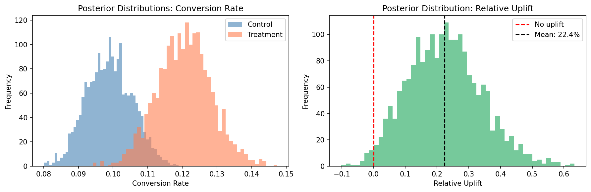

# Bayesian A/B Testing — E-Commerce Conversion Rate Analysis

**Tools:** Python · PyMC · ArviZ · NumPy · Matplotlib  
**Method:** Bayesian inference · MCMC (NUTS sampler) · Beta-Binomial model  
**Domain:** E-commerce conversion rate optimisation  

---

## Overview

A Bayesian approach to A/B test analysis, comparing two email campaign variants on conversion rate for an e-commerce retailer. Rather than returning a binary reject/fail-to-reject decision, the Bayesian framework quantifies the full probability distribution over conversion rates and directly answers the business question: *what is the probability that the treatment outperforms the control, and by how much?*

This project demonstrates why Bayesian inference is often preferred over frequentist hypothesis testing in commercial settings. It produces interpretable, actionable outputs (probabilities and credible intervals) rather than p-values, and naturally incorporates uncertainty into revenue impact estimates.

---

## Experiment Design

| Parameter | Value |
|---|---|
| Control group size | 2,000 visitors |
| Treatment group size | 2,000 visitors |
| True control conversion rate | 10.0% |
| True treatment conversion rate | 12.5% |
| Observed control conversions | 197 (9.85%) |
| Observed treatment conversions | 240 (12.00%) |
| Sampler | NUTS (No-U-Turn Sampler) |
| Draws | 2,000 · Tune: 1,000 |

Data is synthetically generated for reproducibility, but the framework directly applies to real-world A/B testing scenarios. The slight divergence between true and observed rates reflects natural sampling variation.

---

## Model

A Beta-Binomial conjugate model with uninformative priors:
```
p_control    ~ Beta(1, 1)
p_treatment  ~ Beta(1, 1)

obs_control   ~ Binomial(n=2000, p=p_control)
obs_treatment ~ Binomial(n=2000, p=p_treatment)

relative_uplift = (p_treatment - p_control) / p_control
```

Beta(1, 1) is equivalent to a uniform prior, meaning the model places no prior belief on the conversion rate and learns entirely from the data.

---

## Results

| Metric | Value |
|---|---|
| P(treatment > control) | 98.5% |
| Expected relative uplift | 22.4% |
| 95% credible interval (uplift) | 0.8% to 43.3% |
| Control conversion rate (posterior mean) | 9.9% |
| Treatment conversion rate (posterior mean) | 12.1% |



The left panel shows the posterior distributions for each group's conversion rate — the treatment distribution sits clearly to the right of control with minimal overlap. The right panel shows the posterior distribution of relative uplift — almost entirely positive, with a mean of 22.1% and only a small tail below zero.

---

## Revenue Impact

Assuming 50,000 monthly visitors and £45 average order value:

| Metric | Value |
|---|---|
| Expected control revenue | £222,618/month |
| Expected treatment revenue | £271,232/month |
| Expected monthly lift | £48,614 |
| 95% credible interval | £4,510 to £93,922 |
| P(positive revenue impact) | 98.5% |

The credible interval quantifies uncertainty in the revenue estimate. Even the lower bound represents a meaningful positive return, supporting a clear decision to roll out the treatment.
**Decision**: With a 98.5% probability of positive uplift and an expected monthly gain of approximately £48k, the treatment should be deployed.
These results assume constant traffic and average order value, and should be re-evaluated if user behaviour or seasonality changes.

---

## Why Bayesian vs Frequentist?

A frequentist t-test on this data would return a p-value and a binary significant/not-significant verdict. The Bayesian approach instead:

- Directly answers "what is the probability treatment is better?" (98.5%)
- Quantifies the magnitude of the effect with a full distribution
- Propagates uncertainty through to revenue estimates
- Produces results that are immediately interpretable by non-statisticians

---

## How to Run
```bash
# 1. Clone the repository
git clone https://github.com/amdrwn/bayesian-ab-testing
cd bayesian-ab-testing

# 2. Install dependencies
pip install -r requirements.txt

# 3. Run the analysis
python ab_test.py
```

**Note:** PyMC uses multiprocessing. On Windows, sampling runs on a single chain (`chains=1, cores=1`) due to memory constraints. Results remain valid, and convergence is confirmed by ESS > 1,800 on all parameters.